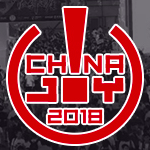

# 快乐的ChinaJoy

## 2018.08.05

​	约07:00集合苏州火车站（记得自己解决好早饭）。使用自己的身份证（或者其他的什么东西）拿车票。07:26乘坐G7209次高铁。

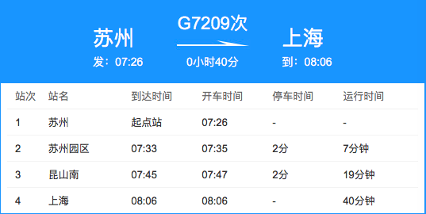

​	预计08:06到达上海站。地铁站在火车站南面。默认乘1号线（实在实在没有办法的话下面有备选路线）。

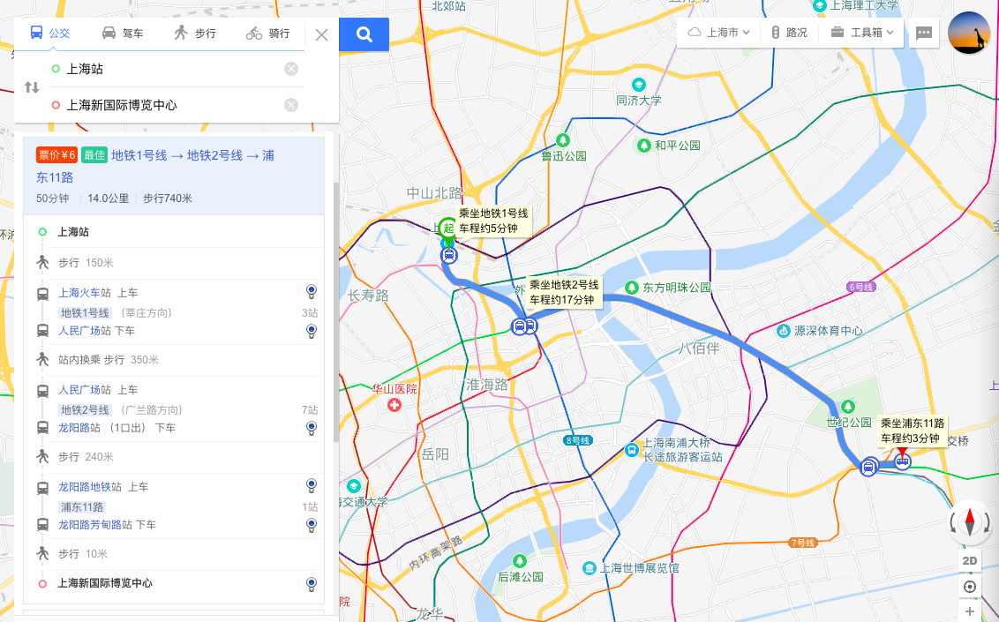

（备选路线）

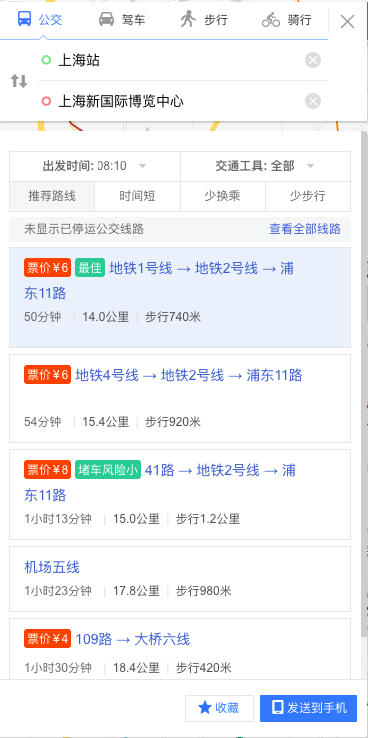

​	预计09:00到达ChinaJoy会场（上海新国际博览中心）。中午饭自带（或者吃贵到爆炸的快餐）。下午16:00展会结束先入住酒店。据说瑞狗要请出租车（以下是地铁路线）。

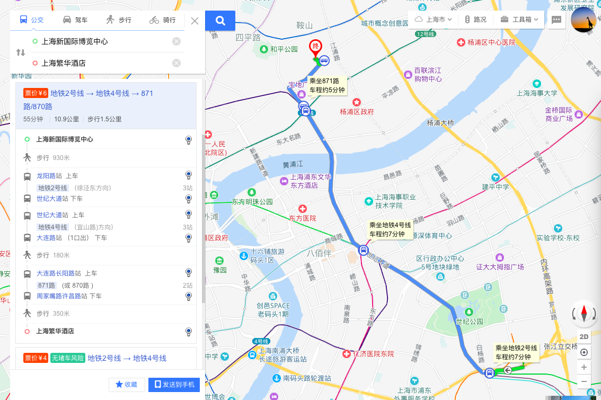

​	傍晚去外滩玩耍。晚饭随机解决（实在不行地铁站里总有一些奇奇怪怪的店）。

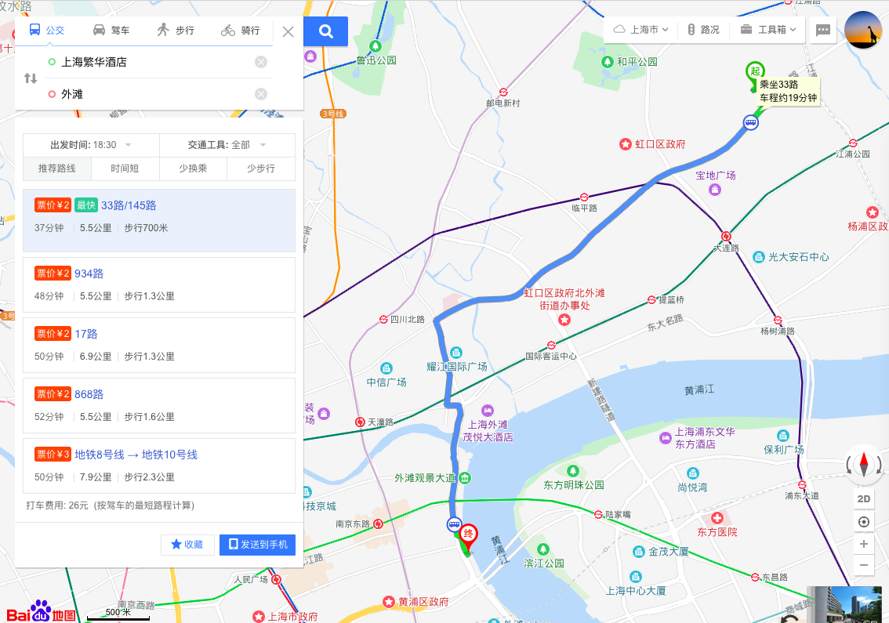

​	记得在地铁／公交末班车之前回酒店。

​	~~如果不幸走散，~~记得地铁4，8，10，12号线都到达酒店附近。

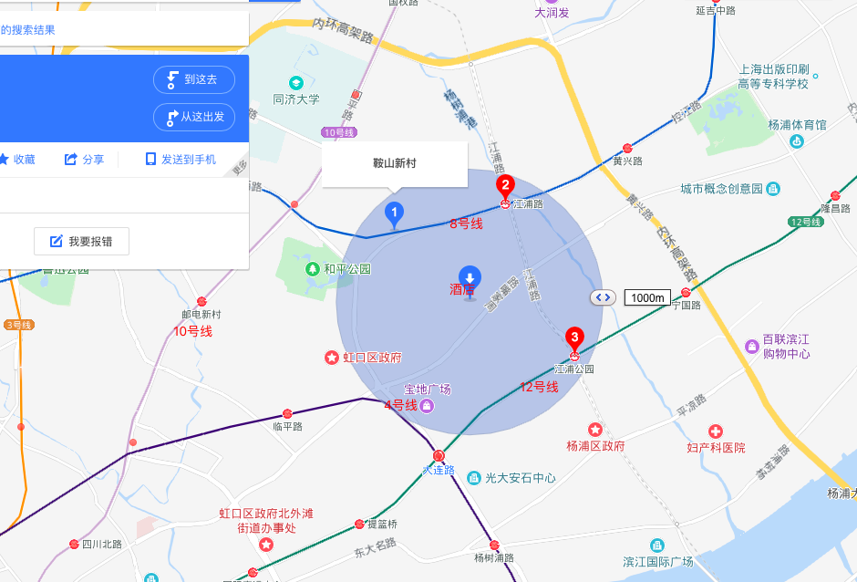

## 2018.08.06

​	早上退房（不要落东西）。

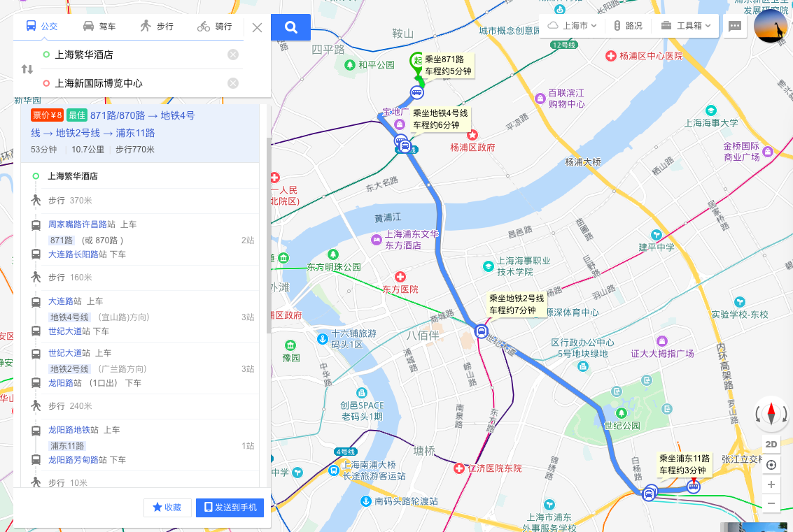

​	下午14:30展会结束。兵分两路。

A回家

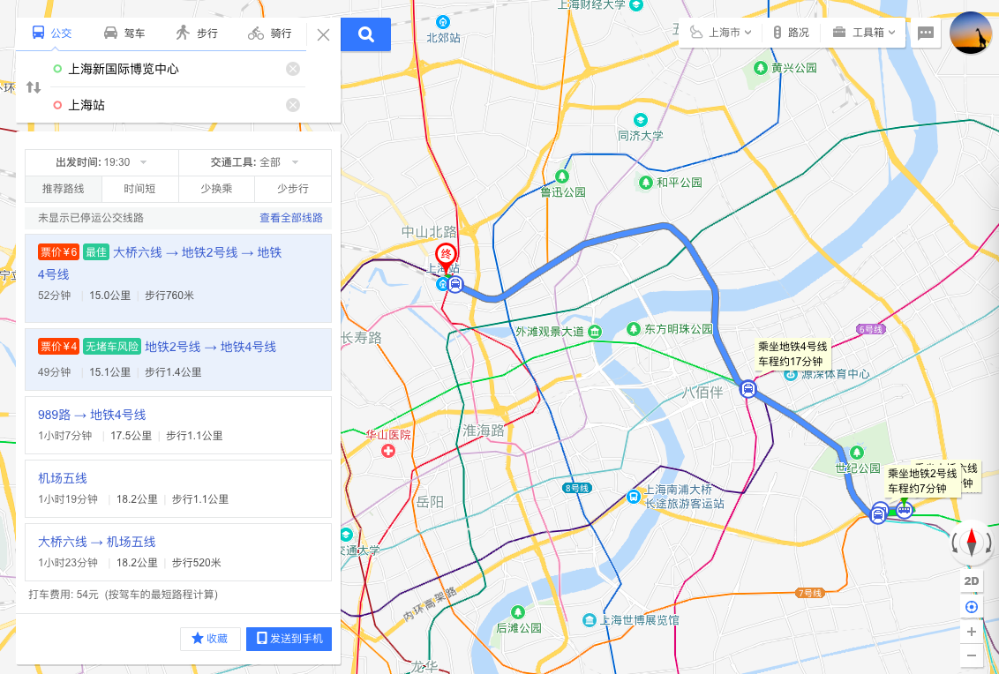

B上大学

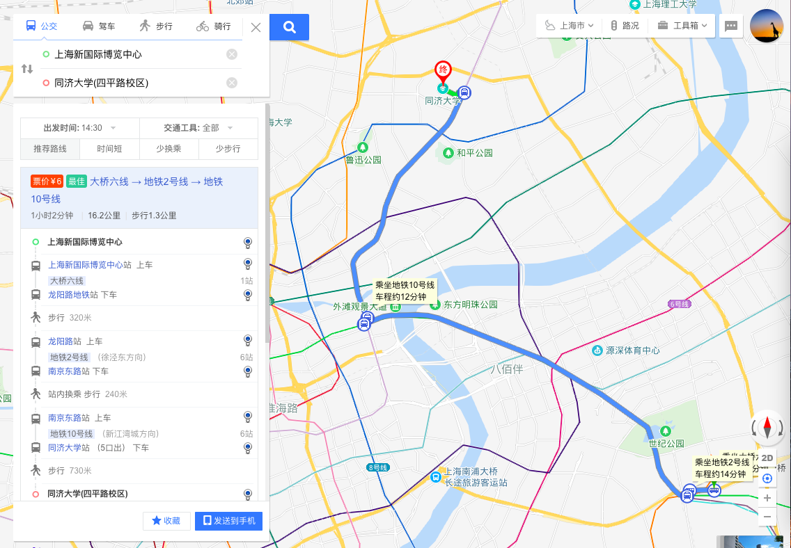

大学回家

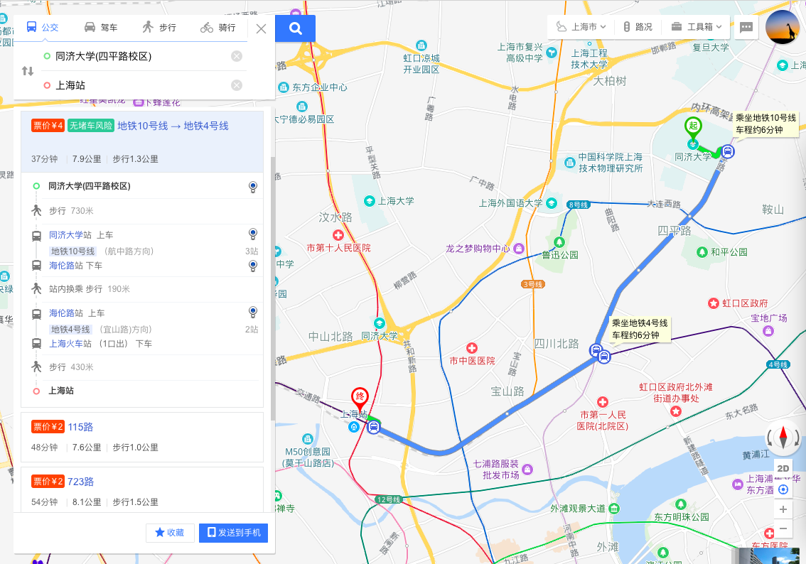

​	高铁回家。

# The End